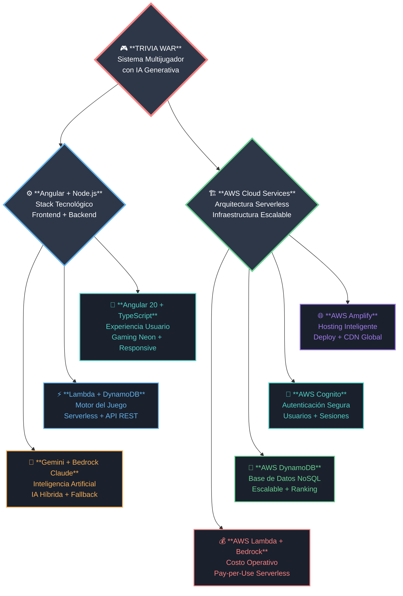
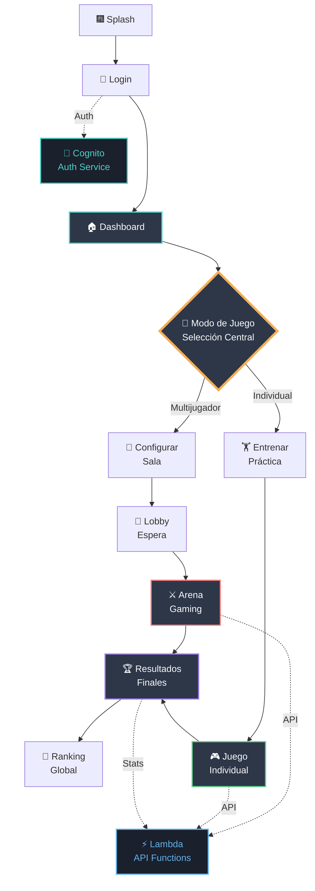
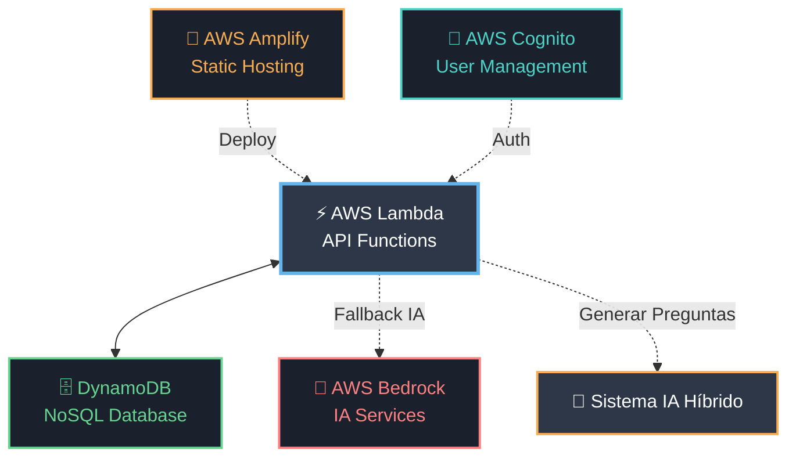
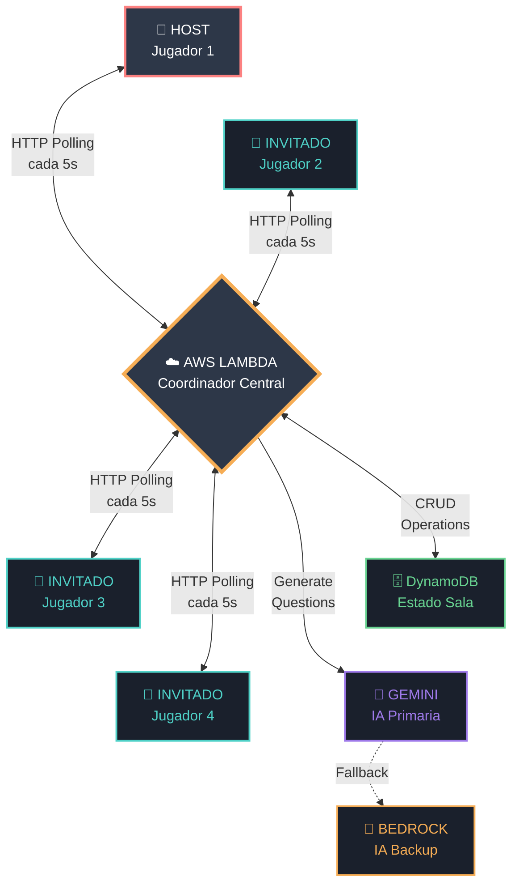

## 🎯 Arquitectura y Tecnología

## 🎮 Flujo de Experiencia de Usuario

### 🖥️ Frontend (Angular 20)

---

### ☁️ Backend (AWS Serverless)

---

### 🤖 Sistema IA Híbrido

## 🏠 Armado de Salas Modo Multijugador

